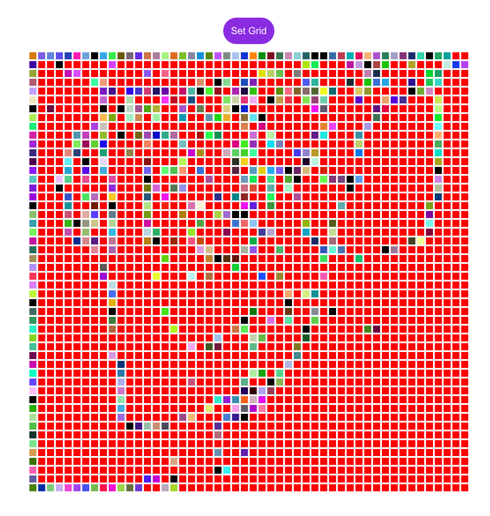

# Etch A Sketch
###### Making etch a sketch using html css js
hope you enjoy p.s every 10 mouse hovers on cells black color shows but other times it wont

you can set a custom grid by pressign set grid and entering a grid number



## Built With

- Javascript 
- Css 
- Html 

## Get Started
1. Clone Project
```bash
git clone git@github.com:joelwillSeek/Etch-A-Sketch-odin.git
```
2. How to run 
Open index.html to browser

## Acknowledgments
[Icons 8](https://icons8.com)